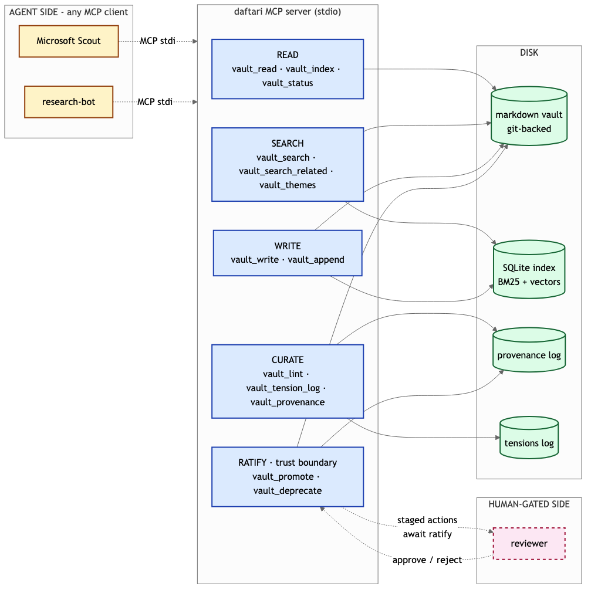

# daftari — Microsoft Agents League @ AI Skills Fest

Agents forget. daftari gives them a persistent markdown archive that reasons across sessions: hybrid BM25 + vector retrieval, draft-to-canonical lifecycle, contradiction logging, and multi-agent provenance — all in a single MCP server. Any agent that calls it accumulates calibrated memory instead of regenerating from scratch. The demo runs a fictional spy-agency archive through Microsoft Scout, showing a multi-hop question answered with footnotes pointing back to vault files, a contradiction logged instead of papered over, and a draft promoted to canonical after human ratification.

---

## Install and run

```
npx daftari quickstart
```

Full docs and source: [mavaali/daftari](https://github.com/mavaali/daftari)

---

## Architecture



*(Open `architecture.excalidraw` in [aka.ms/excalidraw](https://aka.ms/excalidraw) for the editable version.)*

---

## Demo


*Note for Mihir: capture this from the recorded video walkthrough.*

---

## Four things daftari does that nothing else does

- **Hybrid BM25 + vector search in one rank.** BM25 hits exact terms; vector hits semantic neighbors. Neither alone is enough. daftari blends both in a single ranked result, tunable per query.
- **Draft → canonical lifecycle with human ratification gate.** Agents write drafts. Humans promote to canonical. The ratification queue is the trust boundary — agents propose, humans dispose.
- **Tension log: contradictions surfaced, not papered over.** When two sources conflict, daftari records both claims, marks the entry unresolved, and refuses to fabricate a reconciliation.
- **Multi-agent provenance: every write attributed and replayable.** Every file knows which agent wrote it, when, and why. `git blame` for your agent's memory.

---

## For this submission

**Creative Apps (GitHub Copilot) — primary track**

daftari was built with and for GitHub Copilot. The demo runs inside Microsoft Scout, a Copilot-powered client: Copilot-as-builder drafts intelligence assessments, searches prior reports, surfaces contradictions it refuses to paper over, and compiles a footnoted answer — without leaving behind a file that will be stale by next week. For the Creative Apps track: daftari is what Copilot looks like when it keeps a ledger instead of a clipboard. The archive compounds; the clipboard does not.

**Reasoning Agents (Microsoft Foundry) — hedge track**

Multi-step reasoning across sessions fails when the agent's context window resets. daftari is the substrate that does not reset: a versioned, typed vault where every prior conclusion is retrievable, every contradiction is on record, and every session leaves the archive richer than it found it. MCP-native — works with Foundry, Semantic Kernel, AutoGen, and any other runtime. For the Reasoning Agents track: daftari is the cortex layer — the part that turns a stateless reasoner into one that actually accumulates.

---

## What is in this repo

```
.
├── the-daftar/              # demo vault (~100 files, fictional BAI archive)
├── architecture.excalidraw  # editable diagram (open in aka.ms/excalidraw)
├── video-script.md          # full narration script, published for transparency
└── [source repo]            # mavaali/daftari
```

---

## Disclaimer

The Daftar is a fictional intelligence-service archive used as a demonstration corpus. All agencies, assets, operations, and persons depicted are invented. This entry is a demonstration of daftari (mavaali/daftari).

---

**Author:** Mihir Wagle  
**License:** MIT — see [mavaali/daftari](https://github.com/mavaali/daftari) for source
